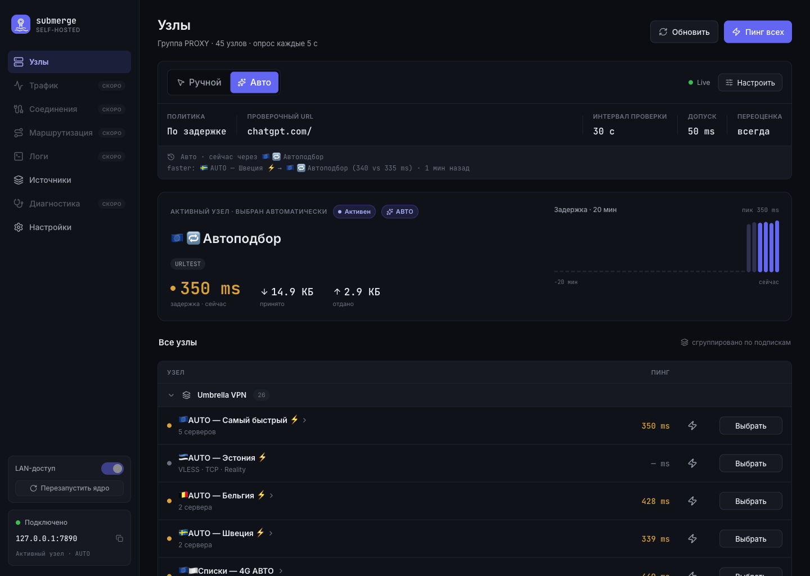
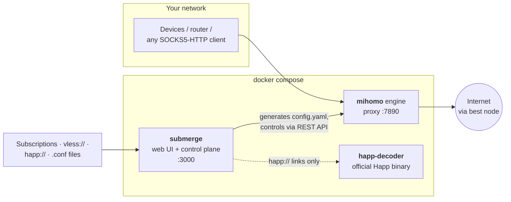
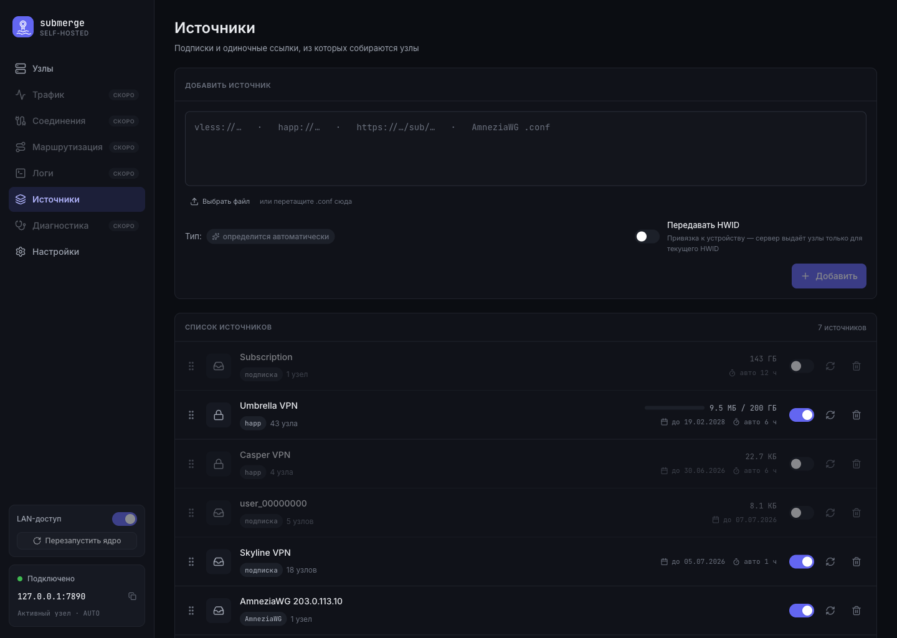
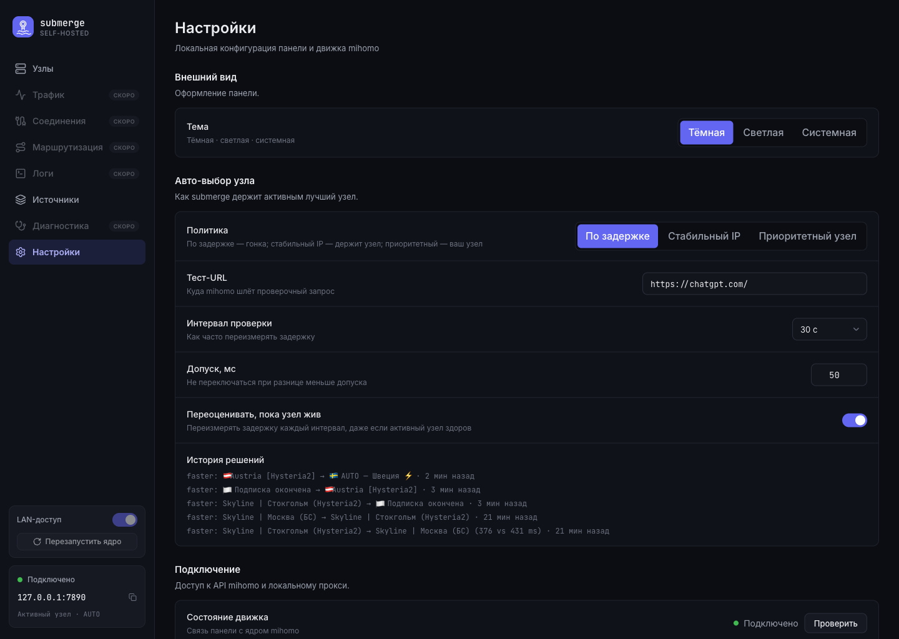

<p align="center">
  <picture>
    <source media="(prefers-color-scheme: dark)" srcset="docs/assets/logo-dark.svg" />
    
  </picture>
</p>

<p align="center">
  <b>All your VPN subscriptions. One local proxy. Zero reconfiguration.</b><br/>
  Self-hosted control panel that merges nodes from every provider you have
  and always keeps the fastest one active.
</p>

<p align="center">
  <a href="https://github.com/gentslava/submerge/actions/workflows/ci.yml"></a>
  <a href="https://github.com/gentslava/submerge/actions/workflows/docker.yml"></a>
  <a href="LICENSE"></a>
  
  
</p>



## The problem

You have more than one VPN provider — a paid subscription here, a backup `vless://` link there,
an AmneziaWG config from a friend, an encrypted `happ://` link from another service. Each comes
in its own format, needs its own client app, and when the active server degrades you switch
everything by hand, on every device.

## The idea

**submerge turns that pile of subscriptions into a single, self-managing local proxy.**

1. **Paste anything** — a subscription URL, a `vless://` / `happ://` link, a WireGuard `.conf`.
   The type is detected automatically.
2. **submerge merges all nodes** into one list, feeds them to the battle-tested
   [mihomo](https://github.com/MetaCubeX/mihomo) engine, and races them by latency.
3. **Your devices connect once** — to `127.0.0.1:7890` (SOCKS5 + HTTP). Which provider and
   which server is behind that port is submerge's job, not yours. Point a router at it and
   the whole network benefits.

Providers come and go, quotas run out, servers degrade — the proxy endpoint never changes.

## Features

- 🔌 **Every source format through one input field** — auto-detected on paste:
  - subscription URLs: clash-yaml, base64, v2ray/sing-box JSON (+ quota, expiry and
    refresh-interval metadata from provider headers);
  - single links: `vless://`, `vmess://`, `trojan://`, `ss://`, `hysteria2://`, `tuic://`;
  - encrypted **`happ://`** links — decoded by the *official* Happ binary, so it survives
    provider key rotation ([ADR-0001](docs/adr/0001-happ-via-official-binary.md));
  - **WireGuard / AmneziaWG** `.conf` files (drag & drop) and Amnezia `vpn://` links;
  - client deep-links (Clash, sing-box, incy, …) — the wrapped URL is extracted.
- ⚡ **Automatic node selection** with real policies, not just a dumb url-test:
  latency race with a switch tolerance (no flapping), *sticky IP* mode that holds a node
  while it's healthy, *priority node* mode — plus a visible decision history explaining
  every switch. Manual mode one click away.
- 📈 **Live dashboard** — latency and traffic streamed over SSE in real time, per-node ping,
  latency history, nodes grouped by subscription with same-name nodes collapsed into
  auto url-test groups.
- 🔐 **Sane security defaults** — everything binds to `127.0.0.1`; optional single-admin
  password (argon2id sessions) for internet-facing deploys; per-source **X-Hwid** for
  device-bound providers ([ADR-0002](docs/adr/0002-hwid-per-source.md)).
- 📦 **One `docker compose up`** — prebuilt multiarch (amd64/arm64) images from GHCR,
  SQLite persistence, health checks, LAN-access toggle and engine restart from the UI.

## How it works



- **submerge** — the app itself (React SPA + tRPC/SSE server in one container): ingests
  sources, generates the mihomo config, hot-reloads the engine, streams live node status.
- **mihomo** — the tunneling engine (Clash core) that actually moves the traffic:
  VLESS Reality, Hysteria2, WireGuard and friends, health checks, url-test groups.
- **happ-decoder** — the official Happ desktop binary running headless (Xvfb + mitmproxy)
  as an on-demand `happ://` decoding service.

More detail: [docs/architecture.md](docs/architecture.md).

## Screenshots

| Sources — paste, drop a `.conf`, done | Settings — selection policies, decision history |
|---|---|
|  |  |

## Quick start

```bash
git clone https://github.com/gentslava/submerge && cd submerge
docker compose up -d
```

1. Open **http://127.0.0.1:3000** and paste a subscription / `vless://` / `happ://` —
   the type is detected automatically.
2. Point your apps (or router) at the proxy — `127.0.0.1:7890`, SOCKS5 and HTTP on the
   same port:

```bash
curl --proxy socks5h://127.0.0.1:7890 https://api.ipify.org   # prints the node's IP
```

No `.env` is needed for localhost — the compose defaults just work.

> **Note:** the `happ-decoder` image bundles the official Happ desktop + Qt, so it is
> a few hundred MB — the first pull takes a moment.

## Production deploy

The panel is designed to sit behind a TLS reverse-proxy (Traefik / Caddy / Dokploy).
Copy the template and set the essentials:

```bash
cp .env.example .env
```

| Variable | Default | Purpose |
|---|---|---|
| `ADMIN_PASSWORD` | *(empty — auth off)* | Admin password. **Required** before exposing the panel: while empty, anyone can use it. |
| `COOKIE_SECURE` | `false` | Set `true` behind HTTPS, otherwise the browser drops the session cookie. Don't leave blank. |
| `SUBMERGE_BIND` | `127.0.0.1` | Host address for port 3000. Keep loopback and front it with TLS; `0.0.0.0` only for deliberate direct exposure. |
| `MIHOMO_SECRET` | `poc` | Secret for the internal mihomo REST API — change it from the default. |

On **Linux hosts** the `submerge` container runs as uid 999 and writes the shared mihomo
config into the bind-mounted `./mihomo` — make it writable: `chown -R 999:999 mihomo`
(automatic on Docker Desktop).

The runtime `mihomo/config.yaml` contains your nodes and is git-ignored — never commit it.

## Development

Node 24 LTS · pnpm workspaces · strict TypeScript · Biome · Vitest.

```bash
pnpm install
pnpm -F @submerge/server dev    # dev server (serves web + API)
pnpm test                       # vitest
pnpm typecheck                  # tsc -b --noEmit
pnpm lint                       # biome ci .
```

Monorepo layout: [`packages/shared`](packages/shared) (Zod domain schemas — the single
front↔back contract), [`packages/server`](packages/server) (tRPC, Drizzle + SQLite, SSE,
service clients), [`packages/web`](packages/web) (React SPA, Indigo Console design system).
See [CONTRIBUTING.md](CONTRIBUTING.md) and [AGENTS.md](AGENTS.md).

- **Specs:** [docs/specs/](docs/specs/) · **Plans:** [docs/plans/](docs/plans/) ·
  **Decisions:** [docs/adr/](docs/adr/) · **Design system:** [docs/design-system.md](docs/design-system.md)

## Roadmap

The sidebar already hints at it: **Traffic**, **Connections**, **Routing**
(multi-channel: several active channels with per-rule routing), **Logs** and
**Diagnostics** screens are on the way.

## License

[MIT](LICENSE). This project is not affiliated with Happ or mihomo.
